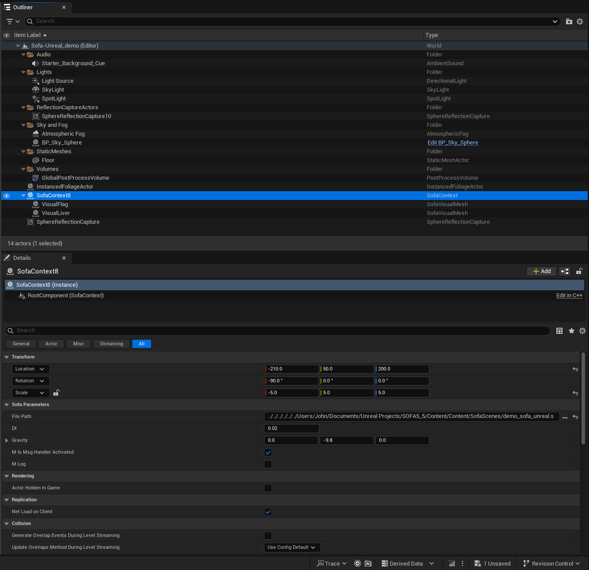

# SofaUE5-Renderer

## Description
This is an **Unreal Engine 5.5 plugin** that renders SOFA physics simulations inside Unreal Engine. All SOFA `VisualModel` components in a loaded simulation are rendered as Unreal `Actors` with `ProceduralMeshComponent`. You can apply Unreal Materials to each visual model and combine UE5's rendering pipeline with SOFA's physics simulation.

> **Note:** This version allows changing Gravity and TimeStep of the SOFA simulation. Only `VisualModel` components are mapped into UE5.

## Compatibility
| Component | Version |
|-----------|---------|
| Unreal Engine | **5.5** |
| SOFA | **23.12** |
| Platform | Windows |
| Visual Studio | 2022 with MSVC v14.38 toolset |

## Installation

### Prerequisites
1. **Unreal Engine 5.5** installed
2. **SOFA 23.12** binaries built with Visual Studio 2022 (MSVC v14.38)
   - Download pre-built binaries from [sofa-framework.org](https://www.sofa-framework.org/download/)
   - Or build from source (recommended for compatibility)

### Steps
1. Clone this repo into your UE5 project's Plugins folder:
   ```
   git clone https://github.com/mackenzie-annis/SofaUE5-Renderer.git YourProject/Plugins/SofaUE5-Renderer
   ```

2. Copy SOFA DLLs to the plugin:
   ```
   YourProject/Plugins/SofaUE5-Renderer/Binaries/ThirdParty/SofaUE5Library/Win64/
   ```
   
   Required files from SOFA build:
   - `SofaPhysicsAPI.dll` and all `Sofa.*.dll` files
   - `plugin_list.conf` (copy from `plugin_list.conf.default`)

3. Configure `sofa.ini` in the same folder:
   ```ini
   SHARE_DIR=C:/path/to/sofa/share
   EXAMPLES_DIR=C:/path/to/your/SofaScenes
   ```

4. Open your `.uproject` file - Unreal will compile the plugin automatically.

Once loaded, you should see the plugin folders in the Content Browser:

<p align="center">
  
</p>

## Usage

### Quick Start 
1. **Place a SofaContext** actor in your level (drag from Place Actors panel → All Classes → SofaContext)
2. **Set the File Path** property to your `.scn` file
3. **Visual meshes spawn automatically** when the scene loads
4. **Hit Play** to run the physics simulation

<p align="center">
  
</p>

*The Outliner shows a SofaContext actor with its auto-spawned SofaVisualMesh children (VisualFlag, VisualLiver). The Details panel displays the Sofa Parameters including File Path, Dt, and Gravity.*

### Manual Setup (Multiple Contexts)
If you need multiple SOFA simulations in one level:

1. Place a `SofaContext` for each simulation
2. Place `SofaVisualMesh` actors manually for each visual model
3. Set `SofaContextRef` on each visual mesh to point to the correct context
4. Set `MeshName` to match the SOFA visual model name

### SofaContext Properties
| Property | Description |
|----------|-------------|
| `File Path` | Path to the `.scn` SOFA scene file |
| `Gravity` | Gravity vector (default: 0, 0, -981) |
| `Dt` | Time step for simulation |
| `m_log` | Enable verbose logging |

### SofaVisualMesh Properties
| Property | Description |
|----------|-------------|
| `SofaContextRef` | Reference to the SofaContext (auto-detected if only one exists) |
| `MeshName` | Name of the SOFA visual model (auto-detected from actor label) |
| `m_isStatic` | If true, mesh won't update during simulation |

## Project Structure
```
SofaUE5-Renderer/
├── Binaries/
│   └── ThirdParty/SofaUE5Library/Win64/   # SOFA DLLs go here
├── Content/
│   └── SofaScenes/                         # Example .scn files
├── SOFAFix/
│   └── SofaPhysicsSimulation.cpp          # Patched SOFA source file
├── Source/SofaUE5/
│   ├── Private/
│   │   ├── SofaContext.cpp                 # Main SOFA integration
│   │   └── SofaVisualMesh.cpp              # Mesh rendering
│   └── Public/
│       ├── SofaContext.h
│       └── SofaVisualMesh.h
└── README.md
```

## Troubleshooting

### "Failed to load SofaPhysicsAPI.dll"
- Ensure all SOFA DLLs are in `Binaries/ThirdParty/SofaUE5Library/Win64/`
- Check that SOFA was built with the same MSVC version as Unreal (v14.38)

### Scene loads but nothing appears
- Check the Output Log for `[SOFA]` messages
- Verify the `.scn` file path is correct
- Ensure `plugin_list.conf` exists and lists required SOFA plugins

### Physics doesn't animate
- Physics only runs during **Play mode** (not in editor preview)
- Check that `m_sofaAPI->start()` is being called (look for "Starting SOFA simulation" in log)

### Dark outlines / duplicate meshes
- This happens with multiple SofaContext actors when visual meshes auto-detect the wrong context
- Solution: Explicitly set `SofaContextRef` on each visual mesh, or use one context per level

### Crash on scene load
- Verify SOFA DLLs match your Unreal's compiler version
- Check `sofa.ini` has correct `SHARE_DIR` path
- Look at crash log for specific SOFA error messages

## Building SOFA from Source

The pre-built SOFA binaries have a bug that causes crashes when loading scenes in Unreal. You'll need to build SOFA yourself with a small fix applied.

### The Fix

There's a missing initialization call in the SofaPhysicsAPI that causes null pointer crashes. We've included the patched file in the `SOFAFix/` folder.

**Quick version:** Copy `SOFAFix/SofaPhysicsSimulation.cpp` to your SOFA source:
```
sofa/src/applications/projects/SofaPhysicsAPI/src/SofaPhysicsAPI/
```

### Build Steps

1. Clone SOFA 23.12:
   ```
   git clone https://github.com/sofa-framework/sofa.git C:/sofa/src
   cd C:/sofa/src
   git checkout v23.12
   ```

2. Apply the fix (copy patched file over the original):
   ```
   copy "YourProject/Plugins/SofaUE5-Renderer/SOFAFix/SofaPhysicsSimulation.cpp" "C:/sofa/src/applications/projects/SofaPhysicsAPI/src/SofaPhysicsAPI/"
   ```

3. Configure with CMake:
   ```
   mkdir C:/sofa/build
   cd C:/sofa/build
   cmake ../src -G "Visual Studio 17 2022" -A x64 -DAPPLICATION_SOFAPHYSICSAPI=ON
   ```

4. Open `C:/sofa/build/SOFA.sln` in Visual Studio, set to **Release**, and build.

5. Copy all DLLs from `C:/sofa/build/bin/Release/` to the plugin's `Binaries/ThirdParty/SofaUE5Library/Win64/` folder.

## Changes from Original (InfinyTech3D)
This fork includes updates for **UE 5.5** compatibility:
- Fixed SOFA simulation initialization (`sofa::simulation::graph::init()`)
- Auto-spawn visual meshes when scene loads
- Auto-detect SofaContext reference
- Fixed mesh pointer invalidation on Play
- Error handling and logging

## License
GPL-3.0 License

Based on [InfinyTech3D/SofaUE5-Renderer](https://github.com/InfinyTech3D/SofaUE5-Renderer)
